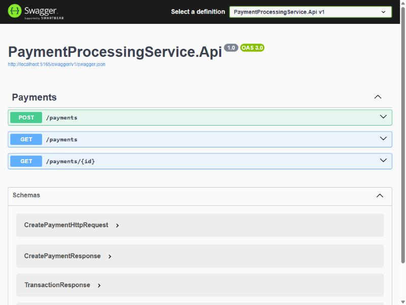
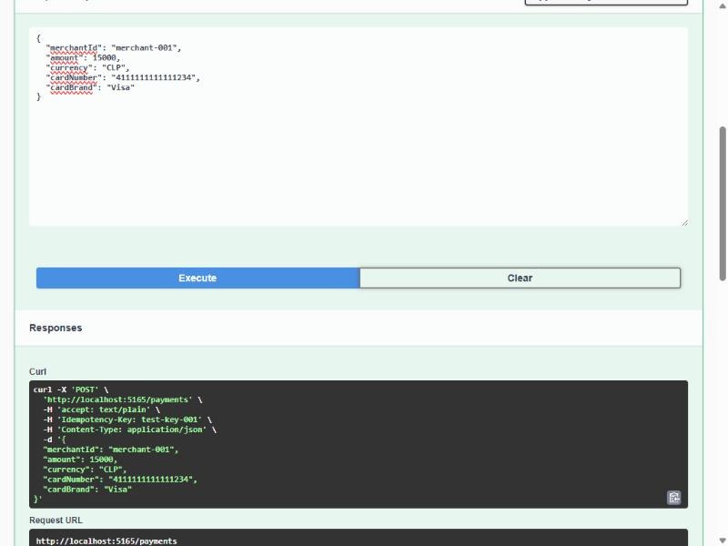

# Pruebas end-to-end — Payment Processing Service

> Evidencia de pruebas manuales realizadas contra el backend corriendo en vivo
> (`dotnet run`), con PostgreSQL real levantado vía Docker. Complementa el checklist de
> `PROGRESO.md` con el detalle de cada prueba: request, response y verificación en base de
> datos.

Fecha de las pruebas: 2026-10-09
Servidor: `http://localhost:5165` (puerto asignado automáticamente por Kestrel)

---

## 1. Swagger UI — documentación viva de la API

Al levantar el servidor con `dotnet run --project src/Api` y abrir `/swagger`, ASP.NET Core
genera automáticamente la interfaz con los 3 endpoints implementados.



---

## 2. `POST /payments` — creación de un pago aprobado

Request armado y ejecutado desde Swagger (captura del `curl` equivalente generado
automáticamente, con el request body y el header `Idempotency-Key`):



**Request:**
```http
POST /payments
Idempotency-Key: test-key-001
Content-Type: application/json

{
  "merchantId": "merchant-001",
  "amount": 15000,
  "currency": "CLP",
  "cardNumber": "4111111111111234",
  "cardBrand": "Visa"
}
```

**Response — `201 Created`:**
```json
{
  "transactionId": "858f4e07-913b-49e4-be81-f1eb604b9d62",
  "status": 2,
  "correlationId": "50b11f51-6503-4f59-b590-c929bd74ff6f",
  "acquirerResponseCode": "00",
  "acquirerMessage": "Transacción aprobada (simulado por Acquirer Mock)"
}
```

**Header de respuesta `Location`:**
```
http://localhost:5165/payments/858f4e07-913b-49e4-be81-f1eb604b9d62
```

**Resultado:** `status: 2` corresponde a `Approved` en el enum `TransactionStatus`
(`Pending=0, Processing=1, Approved=2, Declined=3, Failed=4`) — confirma que el flujo completo
`Pending → Processing → Approved` se ejecutó correctamente.

---

## 3. `GET /payments/{id}` — consulta de la transacción persistida

**Request:** `GET /payments/858f4e07-913b-49e4-be81-f1eb604b9d62`

**Response — `200 OK`:**
```json
{
  "transactionId": "858f4e07-913b-49e4-be81-f1eb604b9d62",
  "merchantId": "merchant-001",
  "amount": 15000.00,
  "currency": "CLP",
  "cardLast4": "1234",
  "cardBrand": "Visa",
  "status": 2,
  "correlationId": "50b11f51-6503-4f59-b590-c929bd74ff6f",
  "createdAt": "2026-10-09T06:55:46.687101Z",
  "updatedAt": "2026-10-09T06:55:47.242897Z",
  "acquirerResponseCode": "00",
  "acquirerMessage": "Transacción aprobada (simulado por Acquirer Mock)"
}
```

**Resultado clave:** `cardLast4: "1234"` confirma que solo se guardaron los últimos 4 dígitos
de `"4111111111111234"` — el número completo nunca se persistió (ver ADR-006 en
`DECISIONES.md`).

---

## 4. Idempotencia — reenvío de la misma petición

Se repitió **exactamente la misma petición** (mismo `Idempotency-Key: test-key-001`, mismo
body) una segunda vez.

**Response — `201 Created` (idéntica a la primera):**
```json
{
  "transactionId": "858f4e07-913b-49e4-be81-f1eb604b9d62",
  "status": 2,
  "correlationId": "50b11f51-6503-4f59-b590-c929bd74ff6f",
  "acquirerResponseCode": "00",
  "acquirerMessage": "Transacción aprobada (simulado por Acquirer Mock)"
}
```

**Verificación directa en PostgreSQL** (sin pasar por la API, para descartar cualquier caché):
```bash
docker exec payment-processing-postgres psql -U payment_user -d payment_processing \
  -c "SELECT \"Id\", \"MerchantId\", \"Amount\", \"Status\", \"IdempotencyKey\" FROM transactions;"
```
```
                  Id                  |  MerchantId  |  Amount  |  Status  | IdempotencyKey
--------------------------------------+--------------+----------+----------+----------------
 858f4e07-913b-49e4-be81-f1eb604b9d62 | merchant-001 | 15000.00 | Approved | test-key-001
(1 row)
```

**Resultado:** mismo `transactionId` devuelto, **una sola fila** en la base de datos — la
idempotencia (ADR-007) funciona correctamente tanto a nivel de lógica de aplicación como de
constraint `UNIQUE` en la base.

---

## 5. `POST /payments` — rechazo por regla de negocio (monto máximo)

**Request:**
```http
POST /payments
Idempotency-Key: test-key-002
Content-Type: application/json

{
  "merchantId": "merchant-002",
  "amount": 2000000,
  "currency": "CLP",
  "cardNumber": "4111111111115678",
  "cardBrand": "Mastercard"
}
```

**Response — `201 Created`:**
```json
{
  "transactionId": "57829adb-c941-4330-83d7-41602f9638ce",
  "status": 3,
  "correlationId": "39d353ba-df1c-484c-8b1c-74fb2dd3643f",
  "acquirerResponseCode": "51",
  "acquirerMessage": "Fondos insuficientes (simulado por Acquirer Mock)"
}
```

**Resultado:** `status: 3` = `Declined`. El monto ($2.000.000) superó el límite simulado en
`AcquirerMockClient` ($1.000.000), devolviendo el código ISO 8583 `"51"` (fondos insuficientes).

---

## 6. `GET /payments?merchant_id=...&status=...` — búsqueda con filtros

**Request:** `GET /payments?merchant_id=merchant-002&status=Declined`

**Response — `200 OK`:**
```json
[
  {
    "transactionId": "57829adb-c941-4330-83d7-41602f9638ce",
    "merchantId": "merchant-002",
    "amount": 2000000,
    "currency": "CLP",
    "cardLast4": "5678",
    "cardBrand": "Mastercard",
    "status": 3,
    "correlationId": "39d353ba-df1c-484c-8b1c-74fb2dd3643f",
    "createdAt": "2026-10-09T06:56:35.945702Z",
    "updatedAt": "2026-10-09T06:56:36.105454Z",
    "acquirerResponseCode": "51",
    "acquirerMessage": "Fondos insuficientes (simulado por Acquirer Mock)"
  }
]
```

**Resultado:** el filtro combinado por `merchant_id` y `status` devuelve exactamente la
transacción esperada.

---

## 7. Validaciones de error

### 7.1 — `POST /payments` sin el header `Idempotency-Key`

**Response — `400 Bad Request`:**
```json
{ "error": "El header Idempotency-Key es obligatorio." }
```

### 7.2 — `GET /payments?status=NoExiste` (valor de estado inválido)

**Response — `400 Bad Request`:**
```json
{ "error": "Estado inválido: NoExiste" }
```

---

## 8. Manejo de errores temporales del adquirente — reintentos y estado `Failed`

Se usó la tarjeta terminada en `9999` (disparador determinístico configurado en
`AcquirerMockClient`, ver ADR-008 en `DECISIONES.md`) para simular que el adquirente no
responde a tiempo.

**Request:**
```http
POST /payments
Idempotency-Key: test-timeout-001
Content-Type: application/json

{
  "merchantId": "merchant-003",
  "amount": 5000,
  "currency": "CLP",
  "cardNumber": "4111111111119999",
  "cardBrand": "Visa"
}
```

**Response — `201 Created`:**
```json
{
  "transactionId": "23834103-537e-4694-8e74-d4832bf937de",
  "status": 4,
  "correlationId": "a0a1d8c1-d63d-4509-a52d-d2e96978d1ae",
  "acquirerResponseCode": null,
  "acquirerMessage": "Acquirer Mock: tiempo de espera agotado (simulado)."
}
```

`status: 4` = `Failed` — tras agotar los 3 reintentos, la transacción queda en un estado final
explícito, nunca ambigua.

**Logs reales del servidor, capturados en vivo durante esta misma petición** (recortados a los
logs propios de la aplicación; se omiten los `info` de SQL generados por EF Core):

```
info: PaymentProcessingService.Application.UseCases.CreatePaymentUseCase[0]
      Transaccion 23834103-537e-4694-8e74-d4832bf937de creada en estado Pending (CorrelationId: a0a1d8c1-d63d-4509-a52d-d2e96978d1ae)
info: PaymentProcessingService.Application.UseCases.CreatePaymentUseCase[0]
      Transaccion 23834103-537e-4694-8e74-d4832bf937de pasó a Processing (CorrelationId: a0a1d8c1-d63d-4509-a52d-d2e96978d1ae)
warn: PaymentProcessingService.Application.UseCases.CreatePaymentUseCase[0]
      Intento 1/3 fallido contra el adquirente para transaccion 23834103-537e-4694-8e74-d4832bf937de (CorrelationId: a0a1d8c1-d63d-4509-a52d-d2e96978d1ae): Acquirer Mock: tiempo de espera agotado (simulado).
warn: PaymentProcessingService.Application.UseCases.CreatePaymentUseCase[0]
      Intento 2/3 fallido contra el adquirente para transaccion 23834103-537e-4694-8e74-d4832bf937de (CorrelationId: a0a1d8c1-d63d-4509-a52d-d2e96978d1ae): Acquirer Mock: tiempo de espera agotado (simulado).
warn: PaymentProcessingService.Application.UseCases.CreatePaymentUseCase[0]
      Intento 3/3 fallido contra el adquirente para transaccion 23834103-537e-4694-8e74-d4832bf937de (CorrelationId: a0a1d8c1-d63d-4509-a52d-d2e96978d1ae): Acquirer Mock: tiempo de espera agotado (simulado).
fail: PaymentProcessingService.Application.UseCases.CreatePaymentUseCase[0]
      Transaccion 23834103-537e-4694-8e74-d4832bf937de marcada como Failed tras 3 intentos fallidos (CorrelationId: a0a1d8c1-d63d-4509-a52d-d2e96978d1ae)
```

**Resultado clave:** se puede seguir el ciclo de vida completo de la transacción
(`Pending → Processing → 3 intentos fallidos → Failed`) filtrando únicamente por el
`CorrelationId` — exactamente la trazabilidad que pide el PDF, demostrada con logs reales, no
solo en teoría.

---

## Conclusión

Las 9 pruebas confirman que el backend funciona **de punta a punta, con datos reales en
PostgreSQL**: creación, consulta, idempotencia, reglas de negocio, filtros, validaciones de
error, y manejo de errores temporales del adquirente con reintentos y trazabilidad completa por
logs. Checklist detallado de requerimientos cubiertos: ver secciones 3 y 4 de `PROGRESO.md`.
